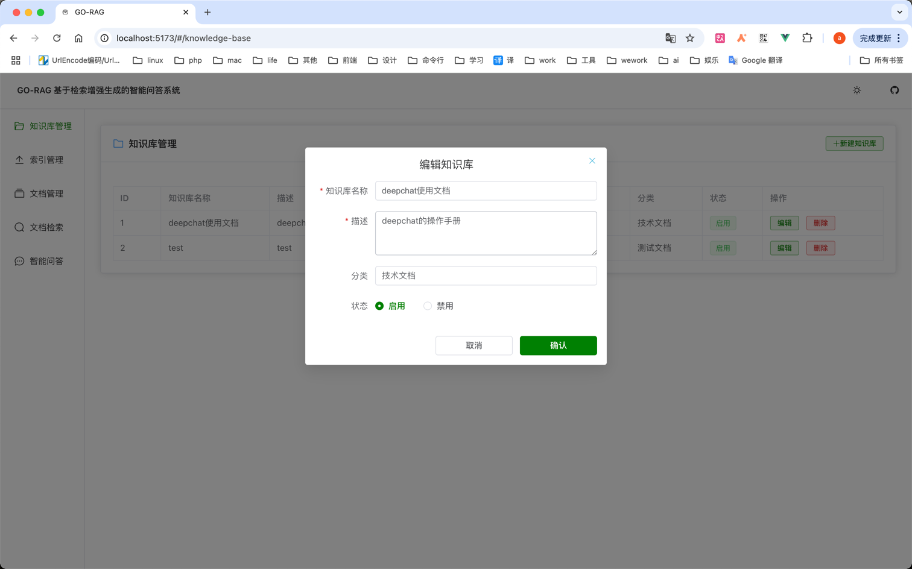
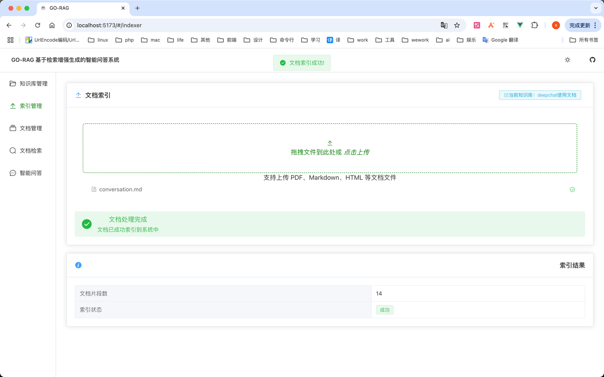
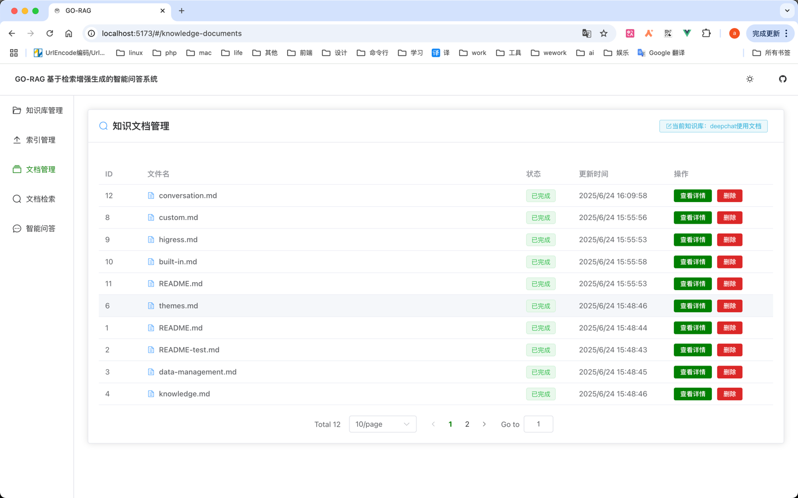
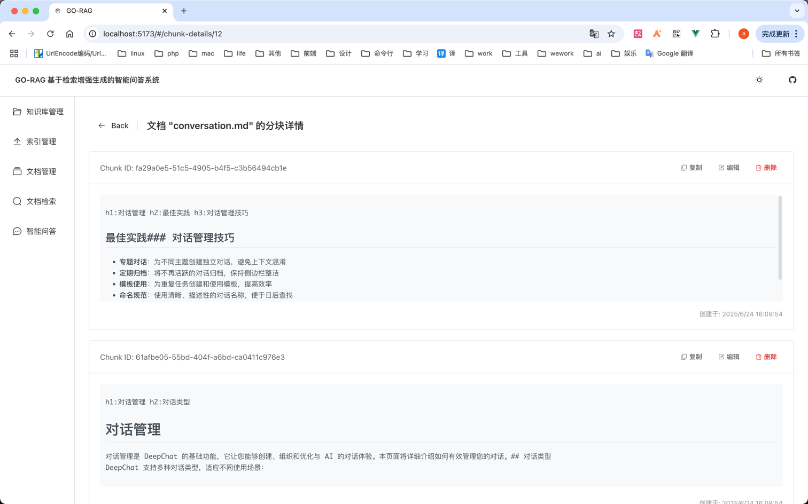
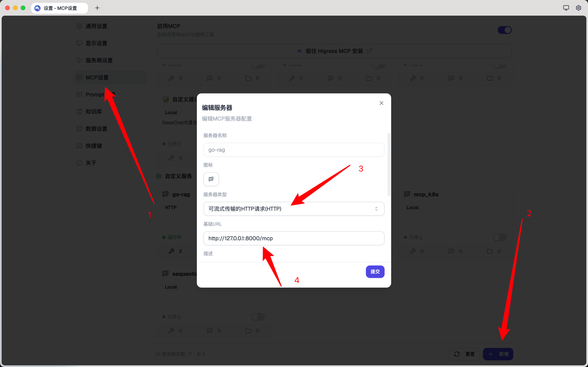
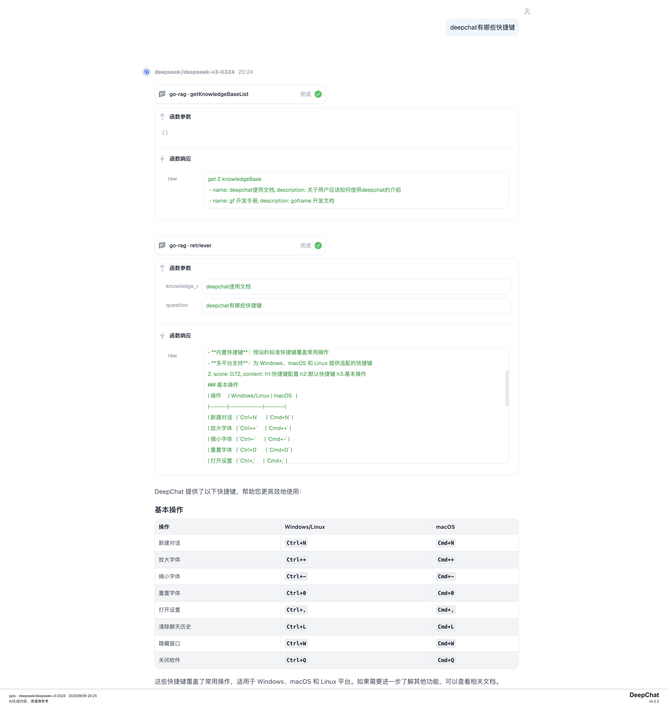

# go-rag
基于eino+gf+vue实现知识库的rag
1. 创建知识库
   
2. 选择需要使用的知识库，上传文档
   
   
3. 文档列表 & chunk 编辑
   
   
4. 文档检索
   
5. 对话
   
6. mcp （以集成到deepchat为例）
   
   

## roadmap
[roadmap](./roadmap.md)

## 存储层
- [x] es8存储向量相关数据

## 功能列表
- [x] md、pdf、html 文档解析
- [x] 网页解析
- [x] 文档检索
- [x] 长文档自动切割(chunk)
- [x] 多知识库支持
- [x] chunk 编辑
- [x] 自动生成 QA 对
- [x] 多路召回

## 使用
### clone项目
```bash
git clone https://github.com/wangle201210/go-rag.git
```

### 使用 Docker Compose 快速启动（推荐）
```bash
cd go-rag
cp server/manifest/config/config_demo.yaml server/manifest/config/config.yaml 
# 修改配置文件中的embedding、chat、mysql、es等配置
docker compose up -d
# 浏览器打开 http://localhost:8000
```

### 使用源码启动
如果有可用的es8和mysql,可以直接快速启动项目，否则需要先安装es8和mysql  
需要修改`config.yaml`文件的相关配置
```bash
cp server/manifest/config/config_demo.yaml server/manifest/config/config.yaml 
# 修改配置文件中的embedding、chat、mysql、es等配置
make build
make run
# 浏览器打开 http://localhost:8000
````

### 安装依赖
*如果有可用的es8和mysql,可以不用安装*  
安装es8
```bash
docker run -d --name elasticsearch \
  -e "discovery.type=single-node" \
  -e "ES_JAVA_OPTS=-Xms512m -Xmx512m" \
  -e "cluster.routing.allocation.disk.watermark.low=1gb" \
  -e "cluster.routing.allocation.disk.watermark.high=1gb" \
  -e "cluster.routing.allocation.disk.watermark.flood_stage=1gb" \
  -e "xpack.security.enabled=false" \
  -p 9200:9200 \
  -p 9300:9300 \
  elasticsearch:8.18.0
```
安装mysql
```bash
docker run -p 3306:3306 --name mysql \
    -v /Users/wanna/docker/mysql/log:/var/log/mysql \
    -v /Users/wanna/docker/mysql/data:/var/lib/mysql \
    --restart=always \
    -e MYSQL_ROOT_PASSWORD=123456 \
    -e MYSQL_DATABASE=go-rag \
    -d mysql:8.0
```

### 运行 api 项目

```bash
cd server
go mod tidy
go run main.go
```

### 运行前端项目

```bash
cd fe
npm install
npm run dev
```

## 使用Makefile构建

- 构建前端并将产物复制到server/static/fe目录 `make build-fe`

- 构建后端 `make build-server`

- 构建整个项目（前端+后端）`make build`

- 清理构建产物 `make clean`

