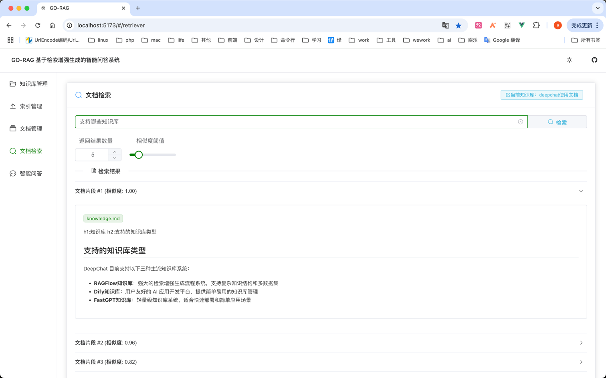
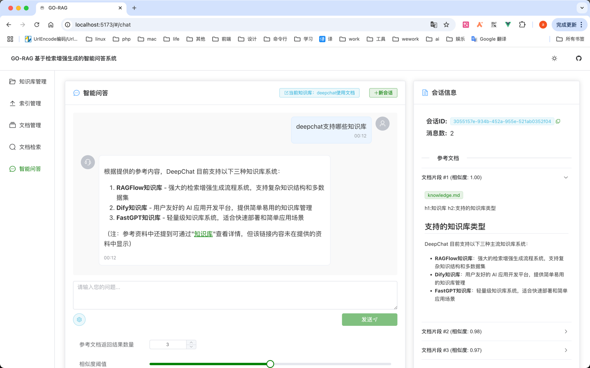

# go-rag api
rag api 项目

## api 运行

```bash
$ cd server
$ go mod tidy
$ go run main.go
```

## fe 运行

```bash
$ cd fe
$ npm install
$ npm run dev
```


## indexer
解析文件并向量化到es 
```bash
curl --request POST \
  --url http://localhost:8000/v1/indexer \
  --header 'content-type: multipart/form-data' \
  --form 'file=[object Object]'
```

## retriever
根据用户提问检索文档
```bash
curl --request POST \
  --url http://localhost:8000/v1/retriever \
  --header 'Content-Type: application/json' \
  --data '{
    "question":"未来计划",
    "top_k":5,
    "score":0.2
}'
```

## chat
检索到文档后回答用户问题
```bash
curl --request POST \
  --url http://localhost:8000/v1/chat \
  --header 'Content-Type: application/json' \
  --data '{
    "question":"未来计划",
    "top_k":5,
    "score":0.2,
    "conv_id":"123-abc"
}'
```
conv_id 是会话id，尽量不相关的问题使用不同的会话id，否则上下文过长会导致大模型回答不准确  
可以用 uuid.New().String()